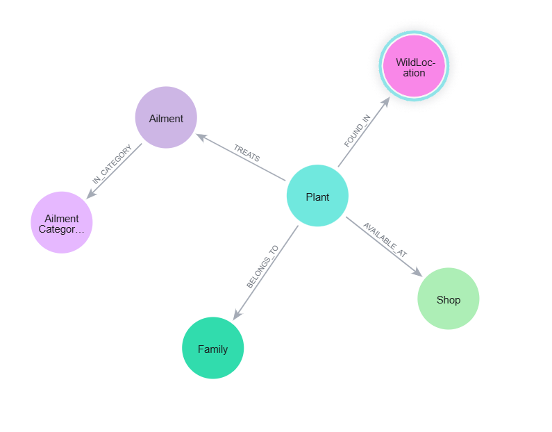
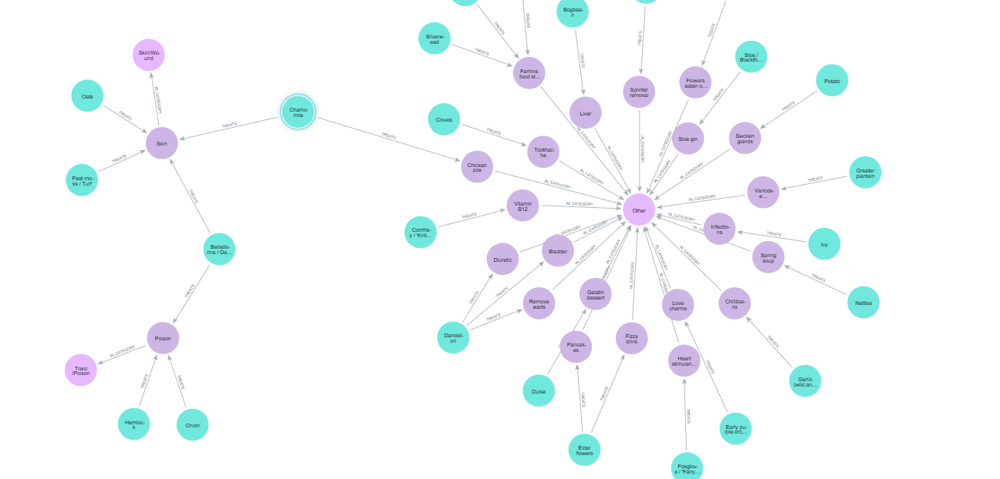
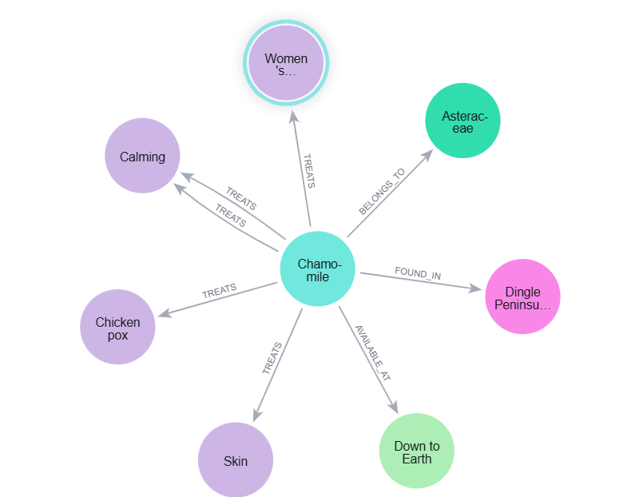

# Irish Medicinal Plant Knowledge Graph (Ochtrinil's Legacy)



A Neo4j knowledge graph of **51 Irish medicinal plants**, built from traditional ethnobotanical knowledge and extended with graph algorithms and machine learning.

The graph links plants to ailments, therapeutic categories, botanical families, wild locations, and Dublin shops where plant-based remedies can be found. It supports explainable condition-to-herb search, similarity-based recommendation, and a graph-derived ML layer.

**Module:** Graph and AI  
**Assignment:** CA 02  
**Student:** Nadeesha Jayasuriya (20093736)

This work is an educational knowledge-graph case study. It is **not medical advice**.

---

## Problem

Traditional Irish medicinal knowledge is fragmented across historical texts, folk practice, geography, and modern retail. A plant may treat several ailments, one ailment may map to many plants, and access may be wild, retail, or both.

The question this project addresses is: **how can that relational knowledge be turned into an explainable graph system for remedy discovery, similarity analysis, and safety-aware search?**

A graph is a better fit than a flat table because the analytical value sits in the connections, not only in plant attributes.

---

## Graph at a glance

| Node type | Count |
|-----------|-------|
| Plant | 51 |
| Ailment | 42 |
| Family | 34 |
| Wild location | 26 |
| Shop | 22 |
| Ailment category | 13 |

**Relationships:** `TREATS` · `IN_CATEGORY` · `BELONGS_TO` · `FOUND_IN` · `AVAILABLE_AT`

```text
                Family
                  ▲
                  │ BELONGS_TO
                  │
WildLocation ◄── Plant ──► Shop
  FOUND_IN        │         AVAILABLE_AT
                  │ TREATS
                  ▼
               Ailment
                  │ IN_CATEGORY
                  ▼
           AilmentCategory
```

Source knowledge was extracted from Dolan (2007), *Ochtrinil's legacy: Irish women's knowledge of medicinal plants*, then cleaned, normalised, and loaded as graph-ready CSVs.

### Neo4j views from the built graph

Plant–ailment neighbourhood in the loaded graph:



Chamomile as a case-study node — uses, family, wild location, and a Dublin shop:



---

## Pipeline

```text
Ethnobotanical JSON
        │
        ▼
Clean / normalise (ailments, toxicity, access)
        │
        ▼
Graph-ready CSVs
        │
        ▼
Neo4j load (constraints + MERGE)
        │
        ▼
Graph algorithms (GDS)
  degree · betweenness · Louvain · node similarity
        │
        ▼
FastRP embeddings + KNN
        │
        ▼
Export plant-level features
        │
        ▼
Python ML (K-means, Lasso, logistic regression)
        │
        ▼
Condition-to-herb queries (safety-first option)
```

---

## What the analysis found

**Most versatile plants** (four distinct ailments each): garlic, chamomile, kelp, carrageen moss, elder flowers, nettles, dandelion.

**Dominant treatment themes:** Skin/Wound, Pain/Musculoskeletal, Respiratory, General Tonic, Digestive.

**Access pattern:** 26 plants retail-fresh, 12 retail-dry, 12 wild-only, 1 mixed. Traditional ecological knowledge still matters even where Dublin shops stock many herbs.

**Degree centrality** ranked highly connected plants such as chamomile, carrageen moss, comfrey, nettles, dandelion, elder flowers, and kelp. That ranking overlaps with versatility.

**Louvain communities** grouped plants and ailments into recognisable medicinal themes (respiratory, skin/wound, digestive, pain).

**Node similarity** produced interpretable pairs, including peppermint ↔ spearmint.

**K-means** on graph-derived features found 4 clusters (silhouette **0.339**): versatile/safe plants, moderate-use herbs, specialised herbs, and simpler retail-visible herbs.

**Lasso** predicting ailment count: **R² = 0.882**, **RMSE = 0.459**. Strongest coefficients were degree centrality, safe multi-use, category count, and betweenness.

The ML layer is an early-stage extension on a small dataset. Results describe structure in this graph; they are not a clinical validation of herbal use.

---

## Project structure

```text
Irish-Medicinal-Plant-Knowledge-Graph-Ochtrinil-s-Legacy-/
├── Graph_and_AI_CS02_20093736.ipynb
├── README.md
├── requirements.txt
├── .gitignore
├── assets/
│   ├── schema_visualization.png
│   ├── basic_graph_view.png
│   └── chamomile_node.png
├── data/
│   ├── ethnobotany_master_data_v2.json
│   ├── categories.csv
│   ├── plant_ailments.csv
│   ├── plant_families.csv
│   ├── plant_locations.csv
│   └── plant_shops.csv
├── docs/
│   └── Graph_and_AI_CA02_20093736.pdf
├── neo4j/
│   ├── 1_Setup_and_loading/
│   ├── 2_Derived_Graph_Features/
│   ├── 3_GDS_And_Graph_Algorithms/
│   ├── 4_Embeddings_and_KNN/
│   ├── 5_Export_And_ML_Bridge/
│   └── 6_Report_Result_Queries/
└── outputs/
    ├── plants.csv
    ├── plant_ailments.csv
    ├── plant_families.csv
    ├── plant_locations.csv
    ├── plant_shops.csv
    ├── categories.csv
    └── charts/
```

| Path | Contents |
|------|----------|
| `assets/` | Neo4j screenshots from the built graph (schema, overview, Chamomile) |
| `data/` | Source JSON and original graph-ready tables from the assignment folder |
| `outputs/` | CSVs used by Neo4j `LOAD CSV`, plus EDA charts |
| `neo4j/` | Cypher scripts, numbered in run order |
| `docs/` | Written report |
| Notebook | Data prep, EDA, and the Python ML extension |

---

## How to run

### 1. Clone the repo

```bash
git clone https://github.com/nadeeshaJ/Irish-Medicinal-Plant-Knowledge-Graph-Ochtrinil-s-Legacy-.git
cd Irish-Medicinal-Plant-Knowledge-Graph-Ochtrinil-s-Legacy-
```

### 2. Python notebook

**Windows (PowerShell)**

```powershell
python -m venv .venv
.\.venv\Scripts\Activate.ps1
pip install -r requirements.txt
jupyter notebook Graph_and_AI_CS02_20093736.ipynb
```

**macOS / Linux**

```bash
python -m venv .venv
source .venv/bin/activate
pip install -r requirements.txt
jupyter notebook Graph_and_AI_CS02_20093736.ipynb
```

The notebook was originally run in Google Colab. Locally, skip the `files.upload()` cells and load:

```python
json_file = "data/ethnobotany_master_data_v2.json"
```

The later ML cells need `plant_graph_features_V2.csv`, exported from Neo4j using `neo4j/5_Export_And_ML_Bridge/24_plant_level_feature_table.txt`.

### 3. Load the graph in Neo4j

1. Start [Neo4j Desktop](https://neo4j.com/download/), Aura, or a Sandbox instance with **Graph Data Science (GDS)** enabled.
2. Run `neo4j/1_Setup_and_loading/7_create_constraints.txt`.
3. Run the remaining load scripts in folder `1_Setup_and_loading` (plants, categories, ailments, families, shops, locations).
4. Continue through folders `2` → `6` in numeric order.

The load scripts pull CSVs from this repository:

```text
https://raw.githubusercontent.com/nadeeshaJ/Irish-Medicinal-Plant-Knowledge-Graph-Ochtrinil-s-Legacy-/main/outputs/
```

If you prefer a local import, copy the files from `outputs/` into Neo4j's import folder and change each `LOAD CSV` URL to `file:///plants.csv` (and the other filenames).

### 4. Condition-to-herb query

Example: search for respiratory remedies (`neo4j/6_Report_Result_Queries/15_condtion_to_herb.txt`). A safety-first variant restricts results to low-toxicity plants (`16_condtion_to_herb_safe.txt`).

---

## Notebook outline

| Section | What it does |
|---------|----------------|
| Data preparation | Load the JSON, standardise ailments, toxicity, and access |
| Graph-ready CSVs | Write plants, ailments, families, locations, shops, categories |
| EDA | Versatility, categories, access, toxicity charts |
| K-means | Cluster plants on graph-derived features |
| Lasso | Predict ailment count from graph measures |
| Logistic regression | Classify safe multi-use plants |

---

## Cypher script order

| Folder | Role |
|--------|------|
| `1_Setup_and_loading` | Constraints and CSV load |
| `2_Derived_Graph_Features` | Validation, counts, access pattern |
| `3_GDS_And_Graph_Algorithms` | Centrality, Louvain, node similarity |
| `4_Embeddings_and_KNN` | FastRP embeddings and KNN |
| `5_Export_And_ML_Bridge` | Plant-level feature table for Python |
| `6_Report_Result_Queries` | Report figures and deployment queries |

---

## References

- Dolan, J.M., 2007. Ochtrinil's legacy: Irish women's knowledge of medicinal plants. *Harvard Papers in Botany*, 12(2), pp.369–386.
- [Neo4j documentation](https://neo4j.com/docs/)
- [scikit-learn Lasso](https://scikit-learn.org/stable/modules/generated/sklearn.linear_model.Lasso.html)

---

## AI usage

AI assistance was used to improve ideas and cross-check correctness of the selected models.
